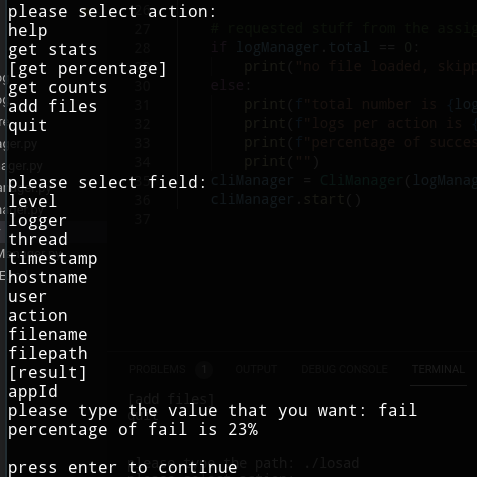

# Question 1
For part 1&2 my answers would be targeted at general cases as before knowing the details anything can be the cause, in the other parts the focus would be the actual scenario.

## Part 1
First of all, I would just start by thinking of a plan (which is actually important), the plan would be composed of simple steps that would be quick and the goal would be to let customers be able to continue their work. some steps for example:
Check if false alarm: look at the downtime monitoring program and see the status
Assuming there’s a proper dashboard: check if other services are down ex: DB
Assuming staff accounts are allowed: connect my browser to the server and test if I can browse a known site with the server
Assuming that we have a failover cluster: configure it to use the backup server and stop using the bad one (if that wasn’t done automatically)

If the issue is actually with our server then with the information that I gathered I can “try to” connect (part 2 says we couldn’t) to the server and fix what’s broken. (need actual server details to give an exact answer, but worse case a server restart should fix it)

There are multiple issues that might happen not from our server but discussing them would be just a waste of time for this assignment.

## Part 2
Not being able to connect using SSH is not the end of the world, but if it happens at a time like this it would make me worry.

There are multiple other options that we can try that would give us different information, for example trying FTP instead: which would give us the ability to download the log files, going to google cloud console and looking at the server console would give us a read only view of what’s logged on the server.

An on-call developer would have knowledge about the structure and can look for company specific options, for example if the database has a table that contains statuses (ex: active sessions) then they’ll look at it. Also the options in part 1 would help without needing SSH.

## Part 3
As I didn't have experience with atop I was hoping that the log file would’ve been enough, but nope, had to use it in the end.

Using VSCode it took me about 5 minutes to find the indicators that i need to be able to investigate, i would use the search feature and it would high-light where the text appears on the right edge:

The first indicator is the string “Internet connectivity test succeeded” which shows two blank periods starting with one starting around the time the notification was received, looking around from there it leads mainly to
* “Proxifier process has become too busy.” which shows from 14:45:38 to 15:18:58
* “Network is unreachable” which shows from 16:12:33 to 17:00:00 (since it wasn’t mentioned in the assignment it might not have been a problem; could be that someone rolled to a different server and disabled this one)

The backtracking journey starts: 
* just scrolling up from 14:45:38, we see that the seconds at 14:45:13 logs a lot of stuff compared to the others
* 14:45:11 -> “failed to set the NOFILE resource limit: Operation not permitted”
* 14:45:04 -> “Cannot free memory by killing tabs” (first indicator to what the issue is)
* “Current memory usage:” shows ram running out
  * 14:45:04 -> 0.5GB
  * 14:44:04 -> 17GB free
  * 14:43:04 -> 33GB free
  * 14:42:04 and before -> 40GB free

Went to ubuntu and installed atop (needed version 2.3 since the 2.4 didn’t work) opened the file with the -r “./path_to_file” and clicked “t” until i reached 14:50 but it didn’t show the issue, had to go to 16:50 and found the issue there, low memory usage and the program that caused the issue was fontforge, at 17:17 it wasn’t there (assuming after ssh worked, someone just killed that process)

If I knew that atop was this easy I would've tried it from the start and would’ve saved a lot of time.

Since fontforge is a text editor and ending the process made stuff go back to normal, I would assume that it isn’t part of the technology stack and that someone installed it.

## Part 4
1. Simply don’t install stuff on server
2. A program to stop process that use a lot of ram (ex: >2GB) is helpful to prvent issues like this but may give limitations if not carfully implemented
3. sending an automatic email if CPU or RAM go above a certain threshold, makes problems more noticable but may cause false positives to happen ex: cpu goes to 90% then back to normal after email is sent

## Part 5
I don’t think that this is worth a wiki page, since if someone connected via ssh and used atop it would be immediately obvious that there was a program taking all the ram, but I would maybe write a note in the on-call instructions wiki (assuming there’s one) to check server ram usage on google cloud console if SSH doesn’t work.

# Question 2

1. there are 5 endpoints, sort by destination and count
2. there are 4 TCP connections, filter by tcp.flags.syn==1 and count
3. tcp retransmission is to resend the packet when the sender doesn’t receive an ACK on it, either after a timeout or when receiver send a duplicate ack, Since at 17.32 sender got a [syn, ack] the cause would’ve been a network congestion, which made the packet come late
4. As mentioned in the blog, we can see the proxy ip, port, and the uri contains the host
5. browser is Firefox 26.0 on Windows (User-Agent: Mozilla/5.0 (Windows NT 6.1; WOW64; rv:26.0) Gecko/20100101 Firefox/26.0\r\n)
6. on ios 15 User agent isn’t sent and the rule filters based on it, Google search leads to https://developer.apple.com/forums/thread/682037

# Question 3
First of all I don’t have any issues with any sort of code. But the requested development can be just replaced with any standard logging and analyzing product and be a lot better and cheaper.

There are multiple options including open source such as ELK stack and enterprise solutions such as Splunk, these technologies can be easily integrated in the code using already made packages.

With that out of the way we can start the assignment
## Requirements
* Total number of log records 
* Number of logs per each action (actions may be any file operation) 
* The percentage of actions whose result is “success”

Those are pretty easy and can be found using a single index per property which can be done directly while using little ram (in other words instead of looking at the rows we would look at the columns).

## Images

## Assumptions
Logs are in the requested json format in one line per log ex:
{“level”: “debug”, ...}
{“level”: “debug”, ...}
see ./input/log1.log as an example

## Design
Just load the log file in a dictionary in the ram in a compressed manner and access it directly in O(1), which also would easily allows us to cache everything, (as opposed to reading the only the required fields and only storing the compiled statistics in ram which would force us to search the disk)

## Limitations
Even though the code should be “production-grade”, the end result would never compete with a proper product like the listed above. This is the case because the requirements are pretty simple.

## Features
1. code is python3
2. no third party packages: just built in python modules, python is included by default in most linux distros
3. interactive cli interface to manage operations using the arrow keys
4. first thing program prints is the assginment requirements to show that it works
5. reads one line at a time which enables it to analize file bigger than the available ram

## Instructions
1. to run test use "python3 ./test.py"
2. to run use "python3 ./main.py <log_file_path>" example: "python3 ./main.py ./input/*.log"
3. use the arrow keys when prompted
4. type the text that you want when prompted

## Things To Improve
1. checking memory usage during runtime
2. caching the compiled data on the desk to save on ram and to restore data next time program runs
3. add a low ram mode where it loops over the files and only read and keep minimal amount of data
4. adding an output manager where it can direct output ex: to both a file and console
5. add the ability to ignore properties since for example a timestamp column would be hard to compress and takes a lot of ram
6. add the ability to remember which files gave each log
7. better compatability with different console sizes
